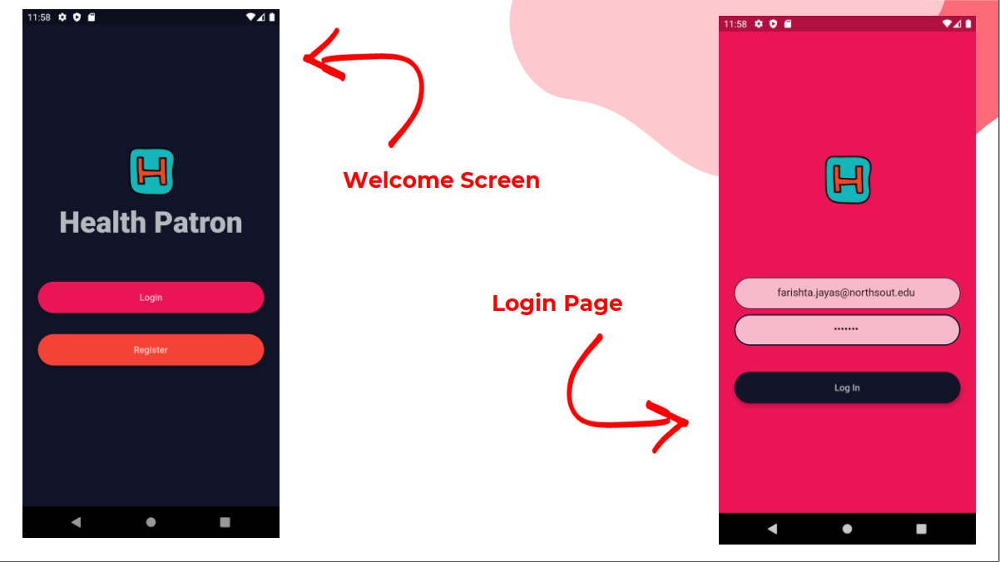
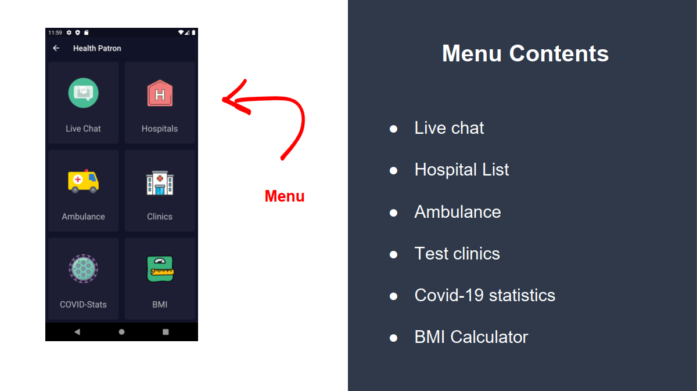
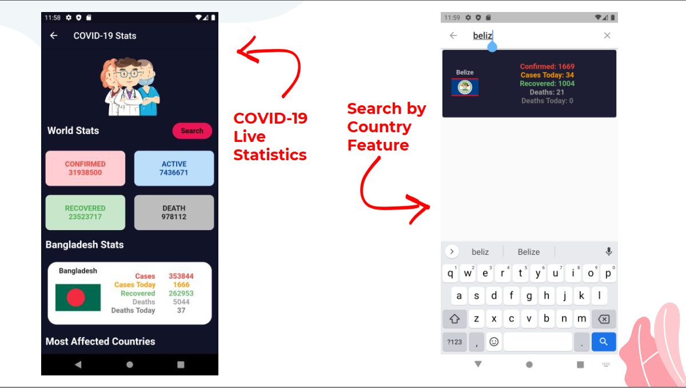

# Health Patron ️

* Framework: Flutter
* Language: Dart
* Backend: Firebase

A companion app that can be used by medical institutions to keep tabs on their patients with the help of high speed, hassle-free textual communication within the constraints of the available laws implemented by the location of their establishment that is safe to use and retains industry-leading safety measures to ensure doctor-patient privacy. Features ● High-speed messaging ● Contact Information of hospitals ● Contact information of Ambulance services ● Contact Information certified COVID-19 testing clinics ● Display of COVID19 daily stats

## Screeshots

## Live COVID19 stats update
* Check out the live covid update. 
* Data is being fetched from an API
                
                https://corona.lmao.ninja/v2/countries/Bangladesh

## Live Messaging App using Firebase integration

1. A user can only read and write messages if they are logged in with their email and password.
2. All the messages are being fetched live from the Firebase Cloudstore Database
3. Everytime a new message is sent, it gets stored in the firebase cloudstore database

